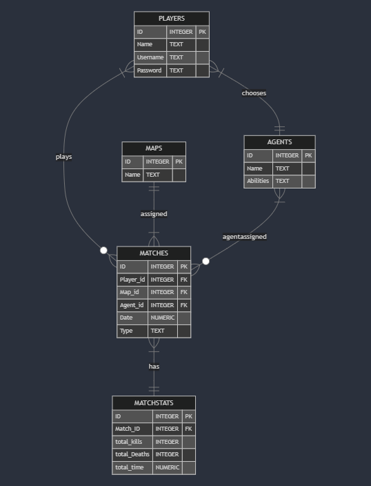

# Design Document

By Vigneshwar Balamurugan

Video overview: <https://youtu.be/Pt9_bLoqahA>

## Scope

In this section you should answer the following questions:

* What is the purpose of your database?
    The purpose of my database is to store and manage the main information required for real-time operations like viewing, updating, inserting, and deleting data. It’s specifically designed with gamers in mind, focusing mainly on FPS (First-Person Shooter) games. My goal is to ensure seamless real-time interactions and deliver a smooth experience tailored to the fast-paced nature of FPS gaming.
* Which people, places, things, etc. are you including in the scope of your database?
    Gamers , Their in-game possesions , stats , match history.
* Which people, places, things, etc. are *outside* the scope of your database?
    Individual match stats , full detailed player stats *its will be a very big database to include all the attributes.
## Functional Requirements

In this section you should answer the following questions:

* What should a user be able to do with your database?
    The user is most likely a E-sports Gaming company , who can retrieve all the info of the player when he/she wish to see so in their game.
    This includes how many matches a player played in a day,or whole career , which agents they picked for a certain match and how many skin(s) a player posses.
    A match's overall stats such as total kills and total deaths also is recorded and can be read.
* What's beyond the scope of what a user should be able to do with your database?
    There are very vast information besides the attributes that is used in this database , so it safe to say this is just a one part of the big model of a database.
## Representation

Entities are captured in SQLite tables with the following schema.

### Entities

The database includes the following entities:

#### Players

`Players` table has the information of the players that are playing the game, it has the following attributes:
- **`id`**: A `PRIMARY KEY` column having an `INTEGER` data type. It should be unique, thus the `PRIMARY KEY` constraint is added.
- **`Name`**: Contains the in-game name of the player that they wish to display. It can have duplicates.
- **`username`**: Contains the user ID which players use to log in. This is distinct and unique, thus the `UNIQUE` column constraint is applied.
- **`password`**: Generally contains the hash value of a password that players save for their corresponding username.

All the table columns will have a `NOT NULL` column constraint as all are necessary fields.

---

#### Maps

The `maps` table contains information about the maps available in the game. It has the following attributes:
- **`id`**: An `INTEGER` column that serves as the `PRIMARY KEY`. Each map has a unique identifier.
- **`Name`**: A `TEXT` column that stores the name of the map. It can have duplicate values if two maps share the same name.

Both columns have a `NOT NULL` constraint to ensure that every map is fully described.

---

#### Agents

The `agents` table contains information about the characters (agents) in the game. It includes the following attributes:
- **`id`**: An `INTEGER` column that acts as the `PRIMARY KEY`. It uniquely identifies each agent.
- **`Name`**: A `TEXT` column representing the name of the agent. Duplicate names are allowed.
- **`Abilities`**: A `TEXT` column that describes the special abilities of the agent. It can be left empty in certain cases.

The `id` and `Name` columns have a `NOT NULL` constraint as they are essential, while the `Abilities` column does not.

---

#### Matches

The `matches` table keeps track of the matches played. It includes foreign key relationships with `players`, `maps`, and `agents` tables. The attributes are:
- **`id`**: An `INTEGER` column that serves as the `PRIMARY KEY`, uniquely identifying each match.
- **`Player_id`**: An `INTEGER` column that acts as a `FOREIGN KEY` referencing the `id` column in the `players` table. It links the match to the player who participated in it.
- **`Map_id`**: An `INTEGER` column that serves as a `FOREIGN KEY` referencing the `id` column in the `maps` table. It connects the match to the map played.
- **`Agent_id`**: An `INTEGER` column acting as a `FOREIGN KEY` referencing the `id` column in the `agents` table. It associates the match with the agent chosen by the player.
- **`Date`**: A `NUMERIC` column representing the date of the match.
- **`Type`**: A `TEXT` column that indicates the type of match (e.g., ranked or unranked).

All columns in this table have a `NOT NULL` constraint to ensure complete match details.

---

#### MatchStats

The `matchstats` table records the statistics of each match. It includes:
- **`id`**: An `INTEGER` column that acts as the `PRIMARY KEY`.
- **`Match_id`**: An `INTEGER` column that serves as a `FOREIGN KEY` referencing the `id` column in the `matches` table. It links the statistics to a specific match.
- **`total_kills`**: An `INTEGER` column representing the total kills recorded for the player in that match.
- **`total_deaths`**: An `INTEGER` column indicating the total deaths for the player in the match.
- **`total_time`**: A `NUMERIC` column specifying the total time played in the match.

All columns have a `NOT NULL` constraint to ensure all statistics are accurately recorded.

### Relationships

The below entity relationship diagram describes the relationships among the entities in the database.

## Optimizations

- CREATE INDEX "player_match" ON "matches"("player_id","agent_id");
The above index is created to optimize the search of playerid by agentid using `COVERING INDEX`.
There is no other optimizations that need not be done at least for these queries.
- A view named `player` have been created to hide the password .
## Limitations

The limitations of my design is very minimal . I would say to add more attributes in a real large scale senario , there will be some addition and removal od columns on foundational tables.
playerstats are NOT INCLUDED.
